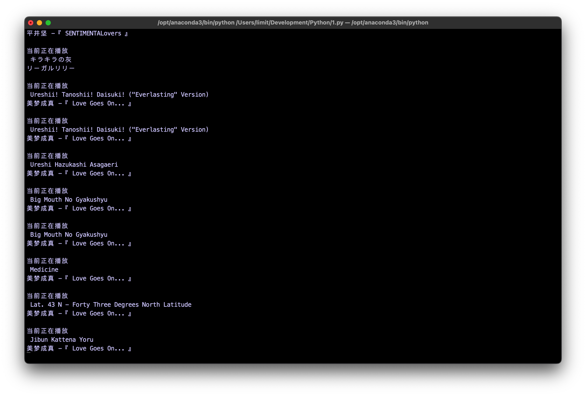

# pwvimacOBS_nowplaying

# 简介

Mac使用OBS直播时，较为优雅显示正在播放歌曲的封面和名称的方案

> 苦恼于在Mac的OBS中显示歌曲信息方案都不太优雅，于是自己手搓了一个，可以实现低性能消耗，较高的可定制性。支持多种软件，只要能在系统控制栏中显示的媒体与音乐，都可以被抓取。

> 本方案基于GitHub上的[nowplaying-cli](https://github.com/kirtan-shah/nowplaying-cli)，十分感谢，有了它能省很多功夫。

---

# 如何使用

1. 首先安装**nowplaying-cli**

```shell
brew install nowplaying-cli
```

2. 配置nowplaying.py中的图像与文本路径，可以依照自己喜好自定义输出设置等。
3. 然后运行nowplaying.py文件，需要支持使用中的的几个常用库（os、time、subproce、pybase64、Image）。
4. 在OBS中导入文本和图像文件，依照自己的喜好进行设置。

# 实现效果

1. 在OBS中导入后的实现效果
   
2. 命令行界面的效果
   
